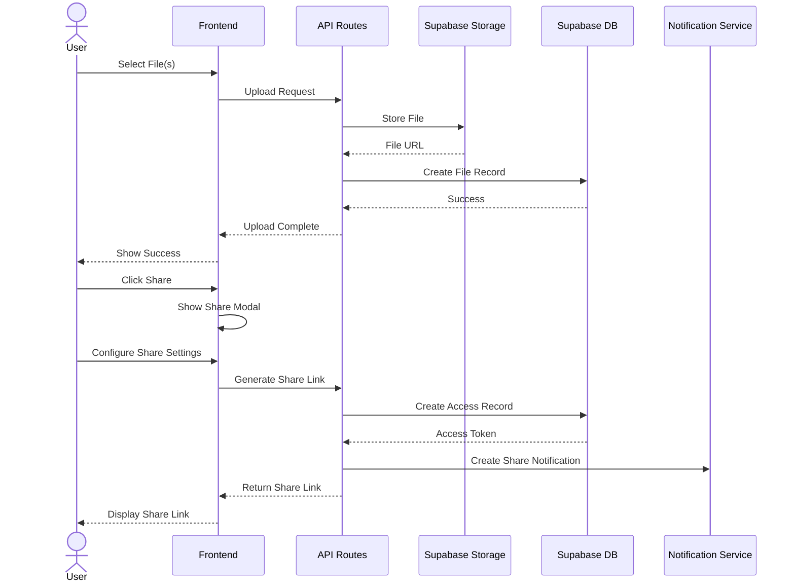
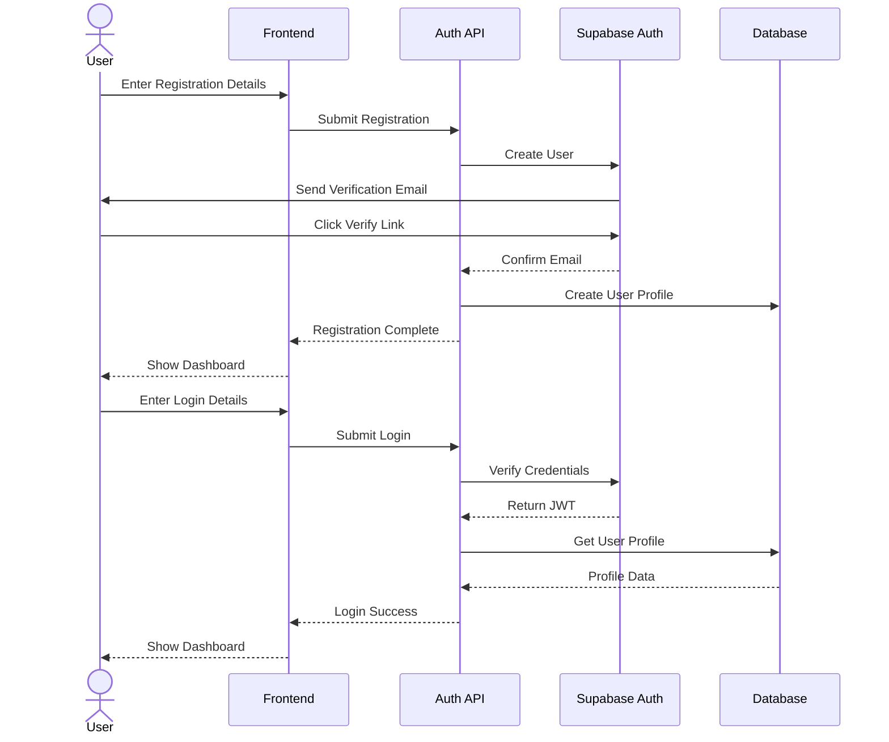
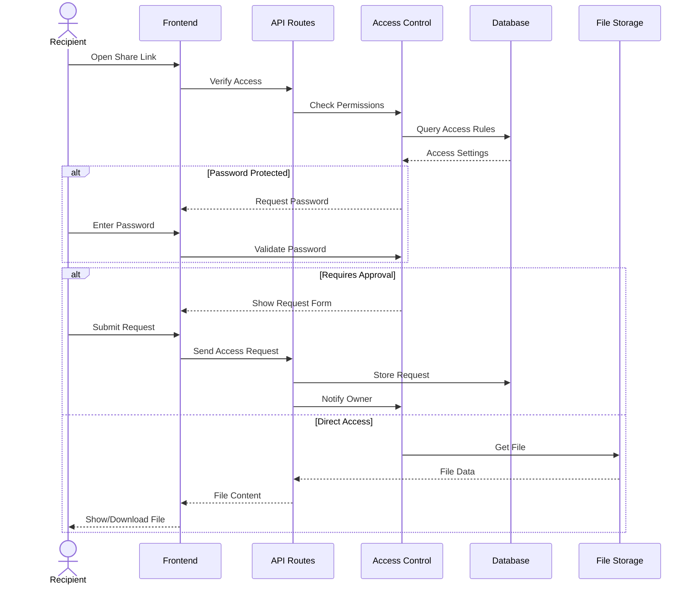

# File Sharing Platform - Workflow Diagrams

## 1. File Upload and Sharing Flow



## 2. Authentication Flow



## 3. Access Control Mechanism



## 4. Notification System

```mermaid
flowchart TD
    subgraph Events["Event Types"]
        FileShare["File Shared"]
        AccessRequest["Access Requested"]
        AccessGranted["Access Granted"]
        AccessDenied["Access Denied"]
    end

    subgraph Handler["Notification Handler"]
        Process["Process Event"]
        Create["Create Notification"]
        Store["Store in Database"]
    end

    subgraph Delivery["Delivery Methods"]
        InApp["In-App Alert"]
        Email["Email"]
        Push["Push Notification"]
    end

    Events --> Handler
    Handler --> Delivery

    Process --> Create
    Create --> Store
    Store --> InApp
    Store --> Email
    Store --> Push